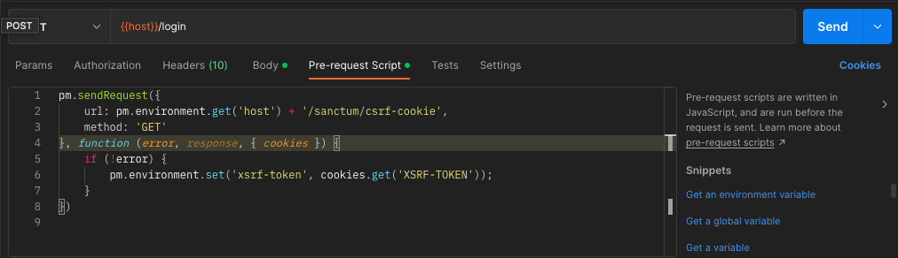

# LifeByte Laravel Project Initialisation Guide & Sample

This project gives a step-by-step guidance on how to initialise a LifeByte Laravel project, and shows a sample project
after initialisation.

## # Initialise Git Repository

1. Create a new Git repository with your ***[PROJECT_NAME]***
2. Create *.gitignore* file in the root path via [gitignore.io](https://www.toptal.com/developers/gitignore/), and
   ignore followings:
    - Laravel
    - Windows
    - macOS
    - Linux
    - PhpStorm+all
    - WebStorm+all
    - VisualStudioCode
    - SublimeText

## # Initialise Laravel Project

For ease of CI/CD, we will put Laravel files in */src* path, so the project file structure will be like this:

```text
|-- lifebyte-laravel-project
    |-- src
        |-- ... // Laravel project files
    |-- .gitignore
    |-- README.md
    |-- ver.txt // Version tag file
    |-- ... // Files for CI/CD
```

1. Go to the project root path
2. Initialise Laravel project: `curl -s "https://laravel.build/src" | bash` (This will create a Laravel project
   under `/src`)
3. Upsert following environment variables in `.env` and `.env.example`:

      ```dotenv
      APP_NAME=   # your application name. such as "Laravel Sample"
      APP_URL=    # Application URL. such as http://laravel-sample.test

      DB_HOST=mysql
      DB_DATABASE=    # your database name, such as laravel-sample
      DB_USERNAME=root
      DB_PASSWORD=

      MEMCACHED_HOST=memcached

      REDIS_HOST=redis

      COMPOSE_PROJECT_NAME= # Docker container name, such as laravel-sample
      ```

4. Create a database with the same name as `DB_DATABASE` environment value
5. Start application with: `cd src && ./vendor/bin/sail up -d`. (It is recommended to add a zsh/bash alias `sail` to
   replace `./vendor/bin/sail`. See
   how: [Configure A Shell Alisa](https://laravel.com/docs/9.x/sail#configuring-a-shell-alias))
6. Run `sail shell` to access the container CLI
7. Run `php artisan migrate` to migrate tables to the new database
8. Now you can build something incredible! For more development guide:
   see [Development Standards - Laravel](https://github.com/lifebyte-systems/lifebyte-web-development-standards/blob/main/laravel/development-standards.md)
9. Write `README.md` in the root path by
   following [Documentation Standards](https://github.com/lifebyte-systems/lifebyte-web-development-standards/blob/main/laravel/project-documentation-standards.md)

## # CI/CD Files

Work with DevOps team to create Docker-based CI/CD files in the root path. Normally should include following:

```text
|-- lifebyte-laravel-project
    |-- .dockerignore // List of project files ignored when building CI/CD Docker container
    |-- Dockerfile
    |-- Dockerfile-base
    |-- entrypoint.sh
    |-- nginx-default.conf
    |-- nginx-main.conf
    |-- ... // Other project files
```

You can see sample CI/CD files in this project.

## # IDE Settings

See [IDE Settings Guide](https://github.com/lifebyte-systems/lifebyte-web-development-standards/blob/main/laravel/ide-settings-guide.md)

## # Laravel Breeze & API

### ## Installation

See [Official guide](https://laravel.com/docs/9.x/starter-kits#breeze-and-next)

### ## Work With Postman

1. Add an **Environment** in Postman with following variables
    - host: The application base URL (add port if you set `APP_PORT` in *.env*, e.g. localhost:8000)
    - api: The API URL path (e.g. localhost/api/v1, localhost:8000/api/v1)
    - referer: `FRONTEND_URL` environment value in `.env`. It is generated by Breeze. (e.g. localhost:3000)

2. Add a **Collection** in Postman, and add the following code under global **Pre-request Script**:

   ```
   pm.request.headers.upsert({key: 'Accept', value: 'application/json' });
   pm.request.headers.upsert({ key: 'Referer', value: pm.environment.get('frontend-url') });
   ```

3. Create login request, and add the following code under its **Pre-request Script**:

   

   ```
   pm.sendRequest({
       url: pm.environment.get('host') + '/sanctum/csrf-cookie',
       method: 'GET'
   }, function (error, response, { cookies }) {
       if (!error) {
           pm.environment.set('xsrf-token', cookies.get('XSRF-TOKEN'));
       }
   })
   ```

4. Add request header: X-XSRF-TOKEN = {{xsrf-token}} and fill request body (form-data):

   
   

5. Make request to /login. This time. Check Postman environment, an new environment ```xsrf-token``` is set, which is equal to the value of ```XSRF-TOKEN``` in the cookies.

6. After logged in, now you are free to make authenticated requests. It is notable that you **MUST** add ```X-XSRF-TOKEN``` and ```Referer``` request header in any POST request for CSRF protection and authentication. As ```Referer``` has set globally, there is no need to set it in request again.

> Learn more with following references: 
> - [Laravel Sanctum (Airlock) with Postman - Blog](https://blog.codecourse.com/laravel-sanctum-airlock-with-postman)
> - [Laravel Sanctum (Airlock) with Postman - Video](https://www.youtube.com/watch?v=QwjzjksfLMo)
> - [CSRF Protection](https://laravel.com/docs/9.x/csrf)
> - [Laravel Sanctum Authentication](https://laravel.com/docs/9.x/sanctum#spa-authenticating)
> - [Laravel Breeze & Next.js / API](https://laravel.com/docs/9.x/starter-kits#breeze-and-next)